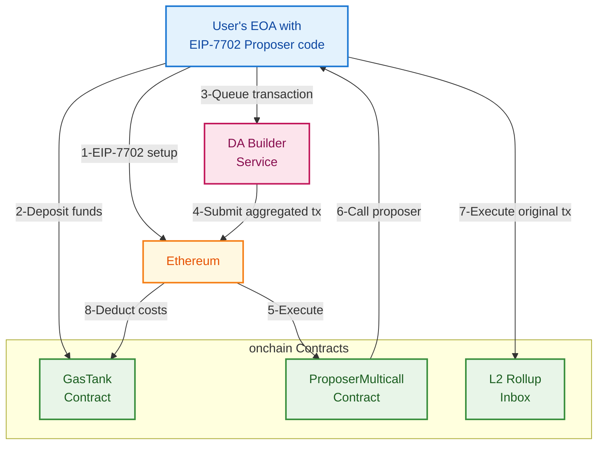

# DA Builder Sample Integration

This repository contains a comprehensive sample integration for [Spire's DA Builder](https://docs.spire.dev/da-builder), demonstrating how to integrate with the DA Builder service to save money on Ethereum transactions through aggregation.

## 💰 Cost Savings

DA Builder is [built to save you money](https://docs.spire.dev/da-builder/the-rollup-cost-killer).

## 🎯 Sample Integration Repository Objectives

This sample integration will help you complete the following objectives:

1. **Get testnet ETH** for your EOA (Externally Owned Account)
2. **Deploy the TrustlessProposer contract** (example that can be expanded upon to meet your needs for production)
3. **Set your EOA account code** using EIP-7702 with the TrustlessProposer
4. **Deposit funds** into the GasTank contract
5. **Submit a transaction** to DA Builder on testnet
6. **Verify the transaction** onchain showing calls being made to the inbox contract
7. **View account status** including on-chain balance and off-chain outstanding charges
8. **Handle transaction failures** with automatic revert detection and clear error reporting

## 🏗️ Architecture

The integration follows the flow described in the [DA Builder documentation](https://docs.spire.dev/da-builder/architecture):



## 🚀 Quick Start

### Prerequisites

- **Rust 1.70+**
- **Foundry**
- **An Ethereum wallet**
- **Testnet ETH** (see step 4 below)

### Features

- **🚀 Full Integration Demo** - Complete DA Builder workflow
- **📊 Account Management** - Check status and balances (on-chain + off-chain charges)

### Setup

1. **Clone and setup:**
```bash
git clone <repository-url>
cd da-builder-sample-integration
chmod +x scripts/setup.sh
./scripts/setup.sh
```

2. **Generate a test wallet (recommended):**

**⚠️ Security Warning:** Never use your main wallet's private key for testing. Create a separate test wallet.

You can generate a new test wallet using Foundry's `cast` command:

```bash
# Generate a new private key and address
cast wallet new
```

3. **Set environment variables:**
```bash
# Required for all deployments
export PRIVATE_KEY="your_private_key_here"

# Testnet defaults (Hoodi - can be overridden)
export TARGET_CHAIN="hoodi"                                     # Default: "hoodi"
export RPC_URL="https://ethereum-hoodi-rpc.publicnode.com"      # Auto-configured per chain
export DA_BUILDER_RPC_URL="https://da-builder.hoodi.spire.dev/" # Auto-configured per chain

# Optional: Override for other chains
export TARGET_CHAIN="holesky"                                   # Holesky Prod
export TARGET_CHAIN="mainnet"                                   # Ethereum Mainnet

# For mainnet deployment
export TARGET_CHAIN="mainnet"
export RPC_URL="your_mainnet_rpc_endpoint"                      # REQUIRED for mainnet
export GAS_TANK_ADDRESS="0x..."                                 # Optional override
export PROPOSER_MULTICALL_ADDRESS="0x..."                       # Optional override
```

**⚠️ Important:** For mainnet deployment, you **must** override the RPC_URL with your own Ethereum RPC endpoint. The default URL is for Hoodi testnet only.

### Chain Configuration Details

| Chain        | Chain ID | DA Builder URL                        | GasTank Address                            | ProposerMulticall Address                  |
| ------------ | -------- | ------------------------------------- | ------------------------------------------ | ------------------------------------------ |
| Holesky Prod | 17000    | https://da-builder.holesky.spire.dev/ | 0x18Fa15ea0A34a7c4BCA01bf7263b2a9Ac0D32e92 | 0x5132dCe9aD675b2ac5E37D69D2bC7399764b5469 |
| Hoodi Prod   | 560048   | https://da-builder.hoodi.spire.dev/   | 0x18Fa15ea0A34a7c4BCA01bf7263b2a9Ac0D32e92 | 0x5132dCe9aD675b2ac5E37D69D2bC7399764b5469 |
| Mainnet Prod | 1        | https://da-builder.mainnet.spire.dev/ | 0x2565c0A726cB0f2F79cd16510c117B4da6a6534b | 0x9ccc2f3ecdE026230e11a5c8799ac7524f2bb294 |

4. **Get testnet ETH:**
   - **Hoodi**: https://hoodi-faucet.pk910.de/
   - **Holesky**: https://holesky-faucet.pk910.de/

### 5. Deploy Contracts and Run Integration

The integration provides a flexible CLI with multiple commands for different use cases:

#### **Full Integration Demo (Default)**
```bash
cargo run --release
```
This runs the complete integration demo.

#### **Account Management Commands**
```bash
# Check account status and balances
cargo run account-status

# Deposit funds to Gas Tank
cargo run deposit

# Show help and all available commands
cargo run help
```

#### **Send a Custom Transaction via DA Builder**
```bash
# Basic usage (pass args after --)
cargo run send -- --to 0xYourContract --data 0xYourCalldata

# With value and gas settings
cargo run send -- --to 0xYourContract --data 0xYourCalldata --value 0.01eth --gas 200000 \
  --max-fee-per-gas 20gwei --max-priority-fee-per-gas 2gwei --deadline 3600
```

Flags:
- `--to <address>`: target address (required)
- `--data|--calldata <0x...>`: calldata (optional)
- `--value <amount>`: value in `wei|gwei|eth|ether` or hex `0x...` (optional)
- `--gas <u64>`: gas limit (optional)
- `--max-fee-per-gas <amount>`: in `wei|gwei` (optional)
- `--max-priority-fee-per-gas <amount>`: in `wei|gwei` (optional)
- `--deadline <seconds>`: seconds-from-epoch deadline for EIP-712 signature (optional; default now+3600)

#### **Command Reference**
| Command          | Description                                        |
| ---------------- | -------------------------------------------------- |
| `demo`           | Run the full DA Builder integration demo (default) |
| `account-status` | Show current account status and Gas Tank balance   |
| `deposit`        | Deposit funds to Gas Tank                          |
| `send`           | Send a custom transaction via DA Builder           |
| `help`           | Show help message and all commands                 |

**🚀 Automatic Build Process:** The build system will automatically:
1. **Compile Solidity contracts** with `forge build` (if artifacts don't exist)
2. **Generate Rust bindings** from the compiled contracts
3. **Compile the Rust application**

The full demo will then:
- Deploy the TrustlessProposer contract
- Set up EIP-7702 account code
- Deposit funds into the GasTank
- Submit a transaction to DA Builder
- Monitor on-chain execution

### 6. Verify on Etherscan

1. Go to [Hoodi Etherscan](https://hoodi.etherscan.io/) or [Hoodi Blockscout](https://eth-hoodi.blockscout.com/)
2. Search for your wallet address
3. Check the transaction history
4. Verify the calls to the GasTank and other contracts

## 📋 Proposer Implementations

Example proposer implementations are available in the `src/proposers/` folder:

- **TrustlessProposer**: Requires a signature proving the underlying call is from the EOA owner
- **UnsafeProposer**: For testing/demonstration only, simplifies the process to make what is happening easier to follow
- **OPStackProposer**: Unsafe but emits events that could be useful for OP Stack chains

## 🧪 Testing

Run the test suite to verify everything works:

```bash
# Run Solidity tests
forge test

# Run Rust tests
cargo test
```

## 🔨 Build Process

The project uses a custom build script (`build.rs`) that automatically handles the Solidity-to-Rust binding generation:

### Automatic Build Flow
1. **`cargo build`** triggers the build script
2. **Build script runs** `forge build` automatically
3. **Forge handles dependency checking** and only rebuilds what's necessary
4. **Generates Rust bindings** from the compiled contract artifacts
5. **Creates `src/generated_contracts.rs`** with Alloy `sol!` macro bindings

This build script may have some limitations regarding its ability to generate bindings. It currently only generates bindings for the contracts in the `src/interfaces`, `src/mocks`, and `src/proposers` directories but could easily be modified to include others. `forge bind` might be a better option for more complex projects.

### Build Artifacts
- **`out/`**: Forge compilation artifacts (JSON files with ABI and bytecode)
- **`src/generated_contracts.rs`**: Auto-generated Rust bindings using Alloy's `sol!` macro

## 🔄 Integration Steps

The complete integration performs these steps:

1. **Deploy TrustlessProposer** - Deploy the secure proposer contract
2. **Set up EIP-7702 account code** - Use CREATE2 to deploy proposer to EOA address
3. **Deposit into Gas Tank** - Deposit ETH into the DA Builder Gas Tank
4. **Submit transaction to DA Builder** - Create and submit a transaction
5. **Monitor execution** - Track the transaction on-chain
6. **Account status** - Display on-chain balance and off-chain outstanding charges

## 📊 Account Management

- **Funding**: deposit ETH into Gas Tank (on-chain) using `deposit`.
- **Status**: the sample shows three values in `account-status`:
  - on-chain balance: `IGasTank.balances(operator)`
  - outstanding_charge: fetched from DA Builder vendor RPC `eth_accountInfo`
  - available balance: `balance − outstanding_charge`

### Gas Tank Deposits
The `deposit` command provides a convenient way to add funds to your Gas Tank:

- **Balance validation** - Checks wallet balance before attempting deposit
- **Flexible amounts** - Accept custom amounts or use suggested defaults
- **Clear feedback** - Shows before/after balances and transaction status

### Usage Examples

#### **Scenario 1: Full Demo**
```bash
cargo run
# Runs complete integration demo
```

#### **Scenario 2: Account Management Only**
```bash
# Check current status
cargo run account-status

# Deposit funds if needed
cargo run deposit
```

#### **Scenario 3: Send a Custom Transaction**
```bash
cargo run send -- --to 0xYourContract --data 0xYourCalldata
```

## 🔧 Troubleshooting

### Common Issues

**"Insufficient funds" error**
- Make sure you have Hoodi testnet ETH
- Check your balance: `cast balance <address> --rpc-url $RPC_URL`

**"Contract not found" error**
- Verify the contract addresses are correct
- Make sure you're using the right network (Hoodi)

**"Signature invalid" error**
- Check that your private key matches your wallet address
- Verify the EIP-712 signature is correct

**"Unauthorized" error**
- Make sure you're calling from the correct address
- TrustlessProposer only accepts calls that have been signed by the EOA owner and originate from itself or the designated multicall contract

**Account status issues**
- Check account status: `cargo run account-status`
- Ensure outstanding charges are covered to avoid interruptions

## 🤝 Support

For questions about this sample integration, please open an issue in this repository.

For questions about DA Builder, visit the [official documentation](https://docs.spire.dev/da-builder) or contact the Spire team at hello@spire.dev or open an issue in this repository.

## 📚 Resources

- [DA Builder Documentation](https://docs.spire.dev/da-builder)
- [EIP-7702 Specification](https://eips.ethereum.org/EIPS/eip-7702)
- [Spire Labs](https://spire.dev)
- [Foundry Book](https://book.getfoundry.sh/)
- [Rust Book](https://doc.rust-lang.org/book/)

## 📄 License

This project is licensed under the MIT License - see the [LICENSE](LICENSE) file for details.
